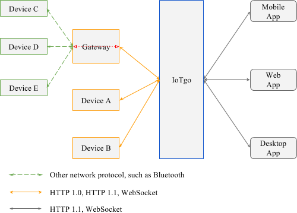

# Hidrun 

## Introdution

We at Hidrun are committed to provide a complete set of hardware for Hidrun platform with open source hardware designs and open source firmware.

The overall Hidrun system architecture including Hidrun, Hidrun-compatible apps and devices is illustrated by following graph.

single-board computer (like Raspberry PI) developers and other embedded system or robot developers could use Hidrun Device API to connect their devices or robots to Hidrun and then easily control them by utilizing Hidrun Web App.

**In one word, we want to provide cloud capability for device or robot developers and device capability for app developers.**

## Future Plan

Hidrun is not an ordinary IoT cloud platform, we designed this platform to be open, simple and easy to use, so everyone can handle the hardware, software and website design in the same time. 

1. Improve UI design: display device connecting status and last connect time on device detail page. [*Connecting status* added]

2. Support GPS device: receive device GPS information and display the exact location on google map.

3. Add the functions of brightness control and RGB adjustment for Light device.

4. Show power consumption information and the control function for Switch device.

5. Store historic data collected from all kinds of sensers.

6. ~~Provide websocket interface and support bidirectional communication between IoTgo and devices.~~ [Done! *Currently is only enabled for indie device*]

7. ~~Provide Android app code.~~ [Done! Please head over to [IoTgo Android App](https://github.com/itead/IoTgo_Android_App)]

#start mongod before running this web server
 sudo /usr/bin/mongod --dbpath /var/lib/mongodb/ --logpath /var/log/mongodb/mongodb.log --logappend &

